# PJ1 实验报告

作者：朱文凯  
学号：23307110192  

## 一、项目概述

本项目为基于终端的迷宫寻路与游戏系统（Maze Path Analysis System）。主要功能包括：迷宫加载显示、玩家移动（WASD）、路径记录与撤销（undo）、路径回放、多槽保存/读取、随机生成迷宫、双人竞赛模式等。

## 二、基础功能与代码示例（补充）

本节补充更完整的示例代码片段、接口契约与常见边界情况，便于课堂演示时解释实现细节。

接口契约（小型约定）

- 输入：迷宫文件（文本），命令串（W/A/S/D，P/U/R/SAVE/LOAD）
- 输出：终端渲染的迷宫、返回值/状态码（成功/失败），以及保存文件
- 错误模式：文件不存在、缺少 S/E、越界移动、保存槽错误
- 成功判据：能正确加载迷宫、执行移动、撤销并能回放命令序列

常见边界与测试用例

- 没有起点或终点的迷宫（应报错并退出加载）
- 连续多次撤销直到起点（栈为空时应安全返回）
- 回放时不修改原状态（先复制状态，再回放）

示例 A — 完整的移动处理（含边界与碰撞检查）

```cpp
// GameLogic.cpp - 简化示例
#include "Maze.h" // 假设有 is_wall(x,y) 和 valid_pos(x,y)
#include "Player.h"
#include <string>

bool try_move(Player &p, const Maze &m, char cmd) {
  static const std::unordered_map<char, std::pair<int,int>> dir = {
    {'W',{ -1, 0 }},{'S',{ 1, 0 }},{'A',{ 0,-1 }},{'D',{ 0, 1 }}
  };
  auto it = dir.find(cmd);
  if(it == dir.end()) return false; // 非移动命令
  int nx = p.x + it->second.first;
  int ny = p.y + it->second.second;
  if(!m.valid_pos(nx, ny) || m.is_wall(nx, ny)) return false; // 撞墙或越界

  p.history.push({p.x, p.y}); // 用栈记录上一步
  p.x = nx; p.y = ny;
  p.commands.push_back(cmd);
  return true;
}

// 使用示例：
// if(!try_move(player, maze, 'W')) printf("无法移动\n");
```

示例 B — 安全撤销与回放（保证回放不会污染当前状态）

```cpp
// Replay: 先拷贝状态，按命令序列重放（不改变原始 history）
void replay(const Player &orig, const Maze &m, double delay_sec=0.5) {
  Player tmp = orig; // 复制当前玩家状态
  for(char c : tmp.commands) {
    // 这里直接调用 try_move，但因为 tmp 是副本，不影响 orig
    try_move(tmp, m, c);
    m.render_with_player(tmp.x, tmp.y);
    std::this_thread::sleep_for(std::chrono::duration<double>(delay_sec));
  }
}

// Undo:
void undo(Player &p) {
  if(p.history.empty()) return; // 安全退出
  auto [px, py] = p.history.top(); p.history.pop();
  p.x = px; p.y = py;
  if(!p.commands.empty()) p.commands.pop_back();
}
```

示例 C — 迷宫加载与验证（包含 S/E 检查）

```cpp
bool Maze::load_and_validate(const std::string &path) {
  if(!load_from_file(path)) return false;
  bool has_s=false, has_e=false;
  for(int i=0;i<rows();++i) for(int j=0;j<cols();++j){
    if(grid[i][j]=='S') has_s=true;
    if(grid[i][j]=='E') has_e=true;
  }
  return has_s && has_e;
}
```

示例 D — 多槽保存（写入二进制元数据 + 游戏状态）

```cpp
// SaveManager::save(slot, state)
// 写入格式：[magic(4)][version(1)][timestamp(8)][step(4)][mazeNameLen(2)][mazeName][body...]
// 二进制格式便于快速读取和版本控制
```

小结（设计提示）

- 把“命令序列”和“位置历史”分开保存，使得回放逻辑更清晰且内存开销小。
- 所有改变游戏状态的操作（move/undo/save/load）都应该有明确的返回值或异常路径，便于课堂演示时说明错误处理。
- 在回放与演示环节，优先使用状态副本来避免破坏正在进行的游戏。

---

## 三、数据结构选择与分析

本项目至少使用以下两类不同的数据结构：

- 顺序容器：`std::vector<std::string>` 用于存储迷宫网格。
    - 优点：随机访问 O(1)、内存紧凑，方便按行渲染。
    - 复杂度：访问和更新为 O(1)。

- 栈（LIFO）：`std::stack<std::pair<int,int>>` 用于实现撤销（undo）。
    - 优点：撤销操作天然是后进先出，push/pop 均为 O(1)。
    - 场景：每次移动前记录当前位置，撤销时 pop 回上一步。

- 动态数组：`std::vector<char>` 记录命令序列以支持回放（replay）。
    - 优点：按顺序记录命令，回放只需顺序遍历，内存和时间效率高。

- 哈希表（可选）：`std::unordered_map` 用于在内存中快速查询保存槽的展示信息或缓存配置等。

小结（复杂度关注）：读取与渲染 O(rows\*cols)，单次移动/撤销 O(1)，回放遍历为 O(steps)。嵌入式的迷宫生成为 O(rows\*cols) 时间。

---

## 四、程序设计要点与优化（设计与优化分析）

1) 模块化设计

    - 将功能拆为 `Maze`、`Player`、`Game`、`SaveManager`、`MenuManager`、`MazeGenerator` 等类。每个类职责单一，便于维护与单测。

2) 内存与性能优化

    - 迷宫使用 `vector<string>`，避免按字符分配小对象，从而减少内存碎片。
    - 路径回放仅保存命令字符（char），而不是完整位置快照，节省内存。
    - 撤销使用栈保存位置对 (x,y)（两个整数），push/pop 都为 O(1)。

3) IO 优化与稳健性
    - 加载文件时做格式校验（是否存在 S/E、行长度一致），避免运行时错误。
    - 保存/读取使用二进制或者紧凑文本格式，记录必要元数据（时间戳、步数、迷宫文件名）。

4) UI/体验优化
    - 回放增加可调速度（0.1s-1.0s），并在回放前复制当前状态，回放后恢复。
    - 保存界面显示简洁的摘要（文件名、时间、步数），方便教学演示。

---

## 五、运行截图

- 程序主菜单截图  
    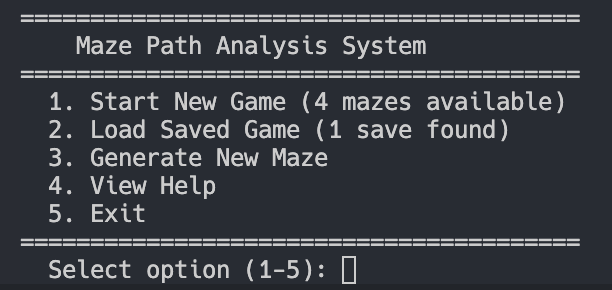
- 单人游戏演示截图（显示当前位置 `@`）  
    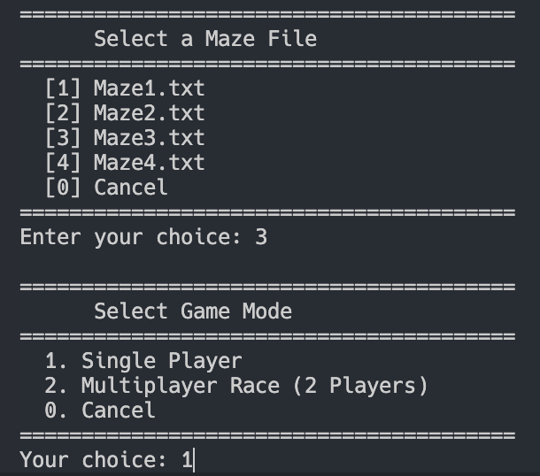  
    单人模式  
- 使用 `P` 打印路径的截图  
    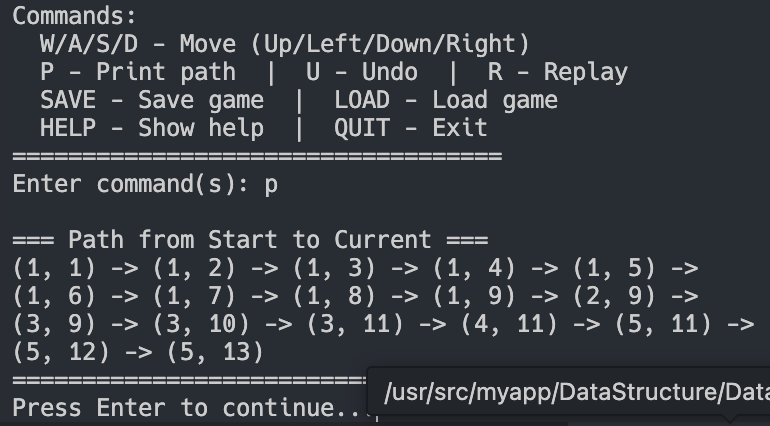
- 使用 `U` 撤销  
    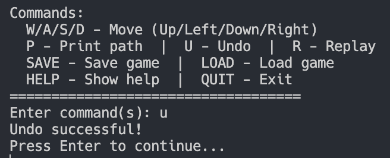  
- 回放（Replay）动画  
    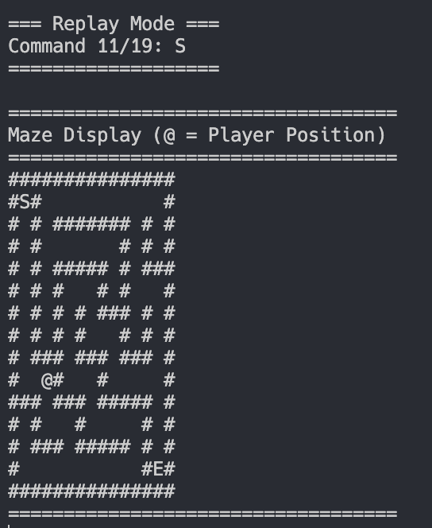  
- 正常结束  
    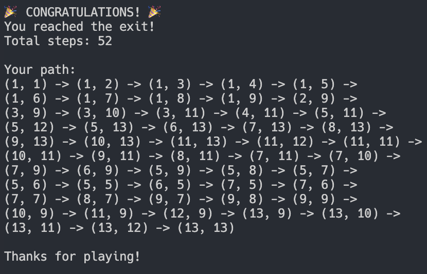  
- 保存/载入槽界面截图  
    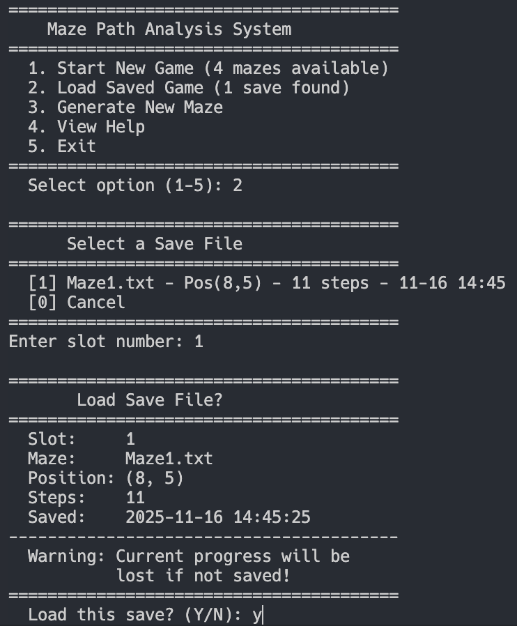  
    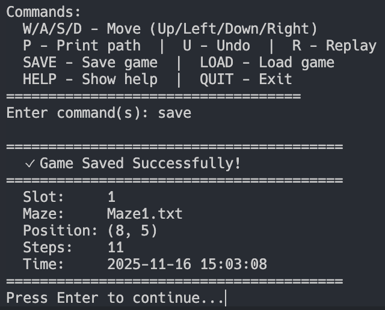  
    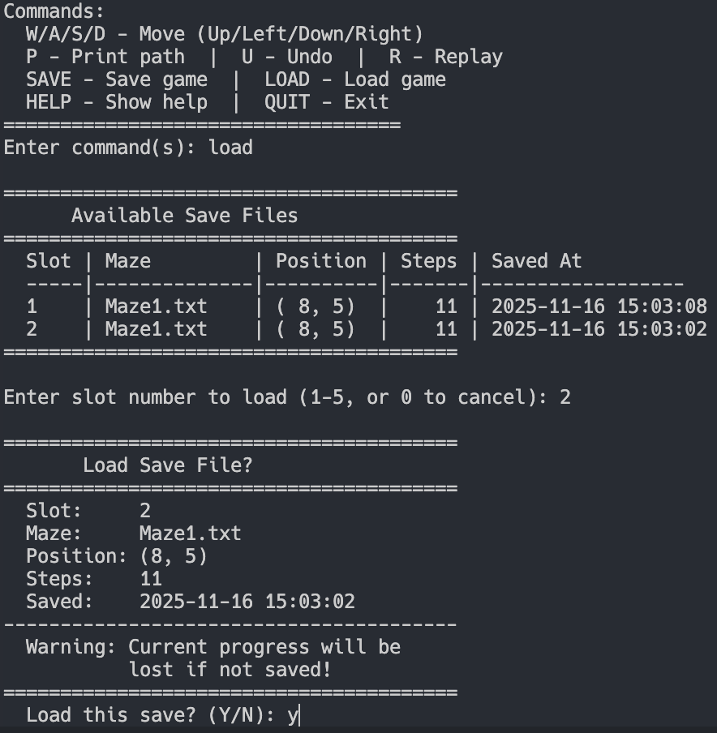  
- 随机生成迷宫的示例截图  
    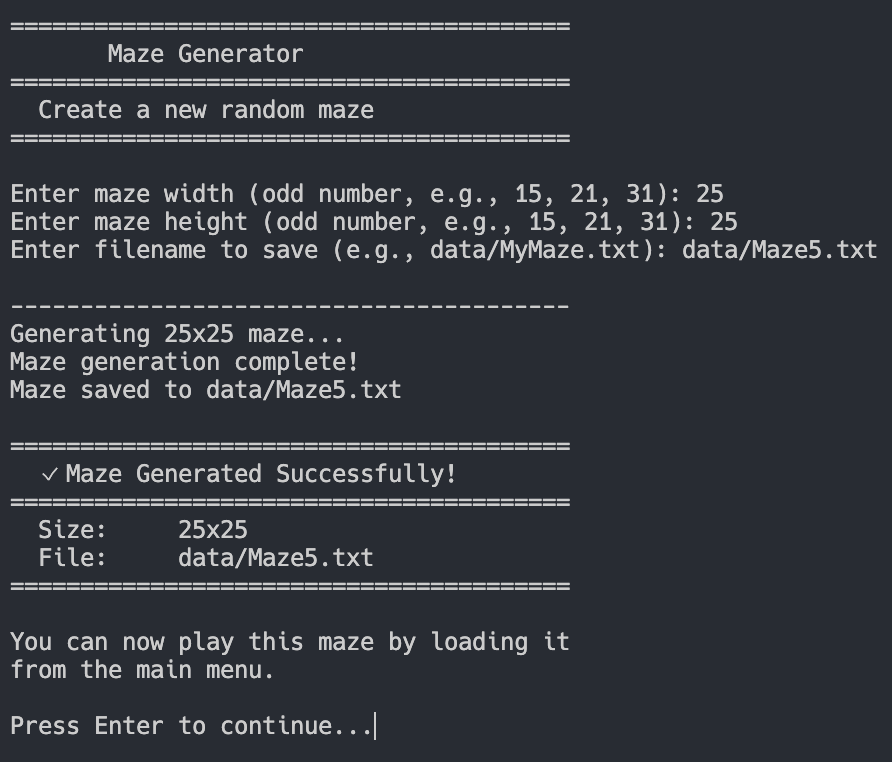  
- 两人竞赛模式运行截图（同时显示 `@` 与 `%`）  
    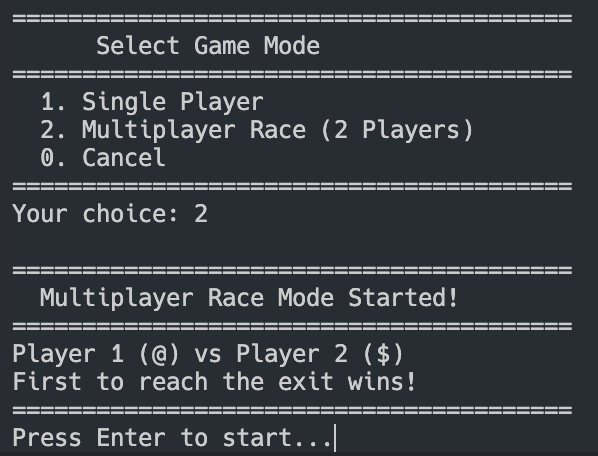  
    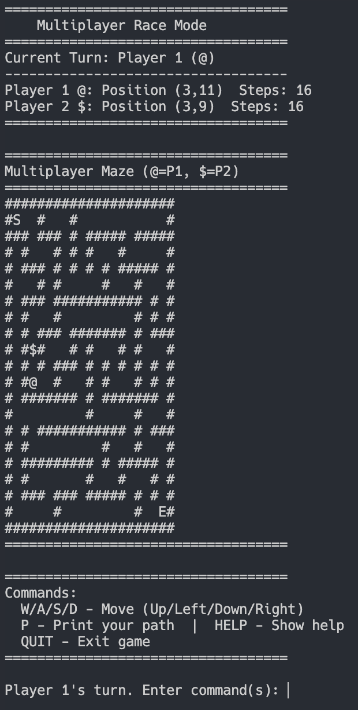  

---
