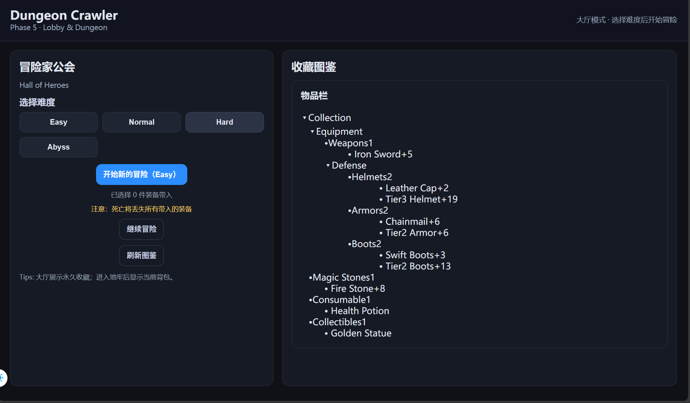
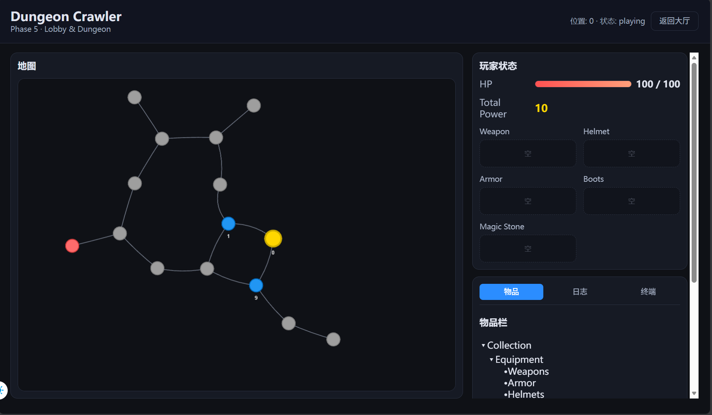
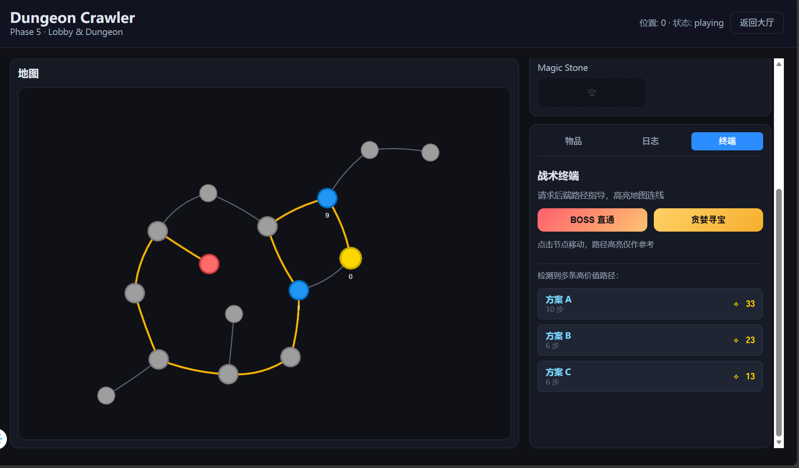
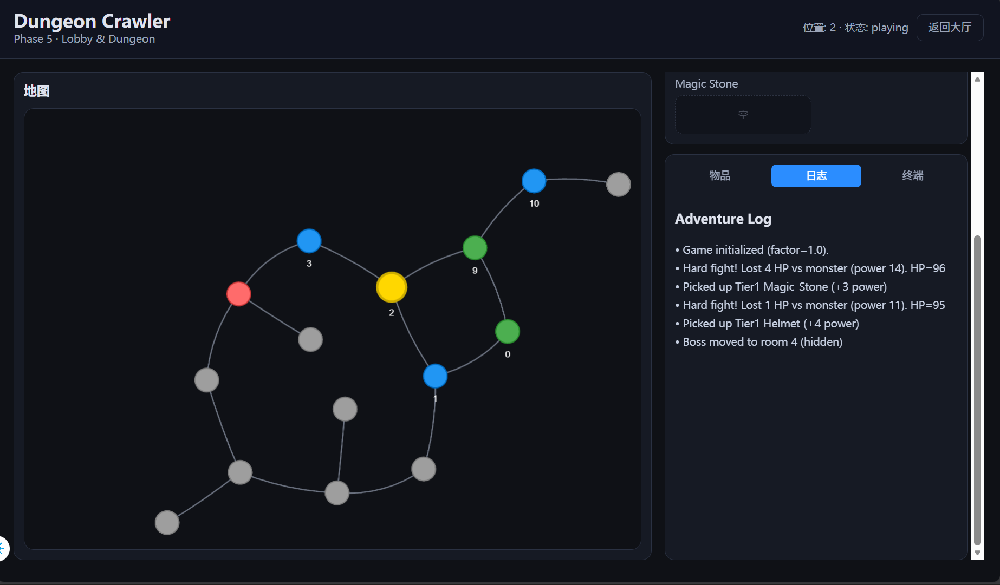

# 数据结构 Project 2：地下城探险与任务规划系统设计报告

**姓名：** 朱文凯  
**学号：** 23307110192  
**日期：** 2025年12月  

---

## 1. 项目概况 (Project Overview)

本项目实现了一个基于 Web 的“地下城探险与任务规划系统”。玩家在随机生成的地下城地图中探索，与怪物战斗，收集战利品以提升战斗力，最终击败 Boss。

系统采用 **前后端分离** 架构：

* **后端**：Python (FastAPI) 负责核心游戏逻辑、地图生成、路径规划及数据持久化。
* **前端**：Vue.js + Vis-network 负责地图的可视化展示、交互操作及战术终端显示。

### 1.1 运行方法

后端：

```bash
# ...
# 推荐先创建虚拟环境
# ...
cd ./backend/pj2_backend
pip install -r requirements.txt
python run.py
```

前端：

```bash
# 需要 Node.js 环境
cd ./frontend/pj2_frontend
npm install
npm run dev
```

---

## 2. 数据结构设计 (Data Structures)

本项目灵活运用了多种数据结构来解决具体问题，主要包括：

### 2.1 图 (Graph) - 地下城地图表示

* **应用场景**：用于表示房间（Node）及其连通关系（Edge）。
* **实现方式**：
    * 使用 **邻接表 (Adjacency List)** 存储地图结构。在 `app/models.py` 的 `Room` 类中，`neighbors: List[int]` 字段存储了与该房间直接相连的房间 ID。
    * `MapStructure` 类包含一个 `rooms` 字典（哈希表）和一个 `edges` 列表，支持 $O(1)$ 的房间查找。
* **设计理由**：地下城是一个稀疏图，邻接表比邻接矩阵更节省空间，且便于遍历计算最短路径。

### 2.2 N叉树 (N-ary Tree) - 战利品管理

* **应用场景**：用于分类管理和展示玩家获得的战利品（如：装备 -> 武器 -> 剑）。
* **实现方式**：
    * 在 `app/core/loot_manager.py` 中定义了 `LootNode` 类。
    * 每个节点包含 `children: List[LootNode]`（子类别）和 `items: List[Dict]`（具体物品）。
    * 根节点为 "Collection"，下分 "Equipment", "Consumable" 等子树。
* **设计理由**：树形结构天然契合物品的层级分类（Category/Type/Item），便于前端进行折叠/展开展示，且支持递归遍历。

### 2.3 优先队列 (Priority Queue / Heap) - 最短路径搜索

* **应用场景**：在地图中计算从当前位置到 Boss 房的最短路径。
* **实现方式**：
    * 在 `app/core/pathfinder.py` 的 `get_shortest_path` 方法中，使用了 Python 的 `heapq` 模块（最小堆）。
    * 堆中存储元组 `(cost, u, path)`，每次取出当前代价最小的节点进行扩展。
* **设计理由**：使用堆优化的 BFS/Dijkstra 算法，能够高效地处理路径搜索，保证在 $O(n log n)$ 的复杂度内找到最优解。

### 2.4 栈与列表 (Stack/List) - 路径回溯与日志

* **应用场景**：
* **DFS 路径搜索**：在搜索高价值路径时，使用递归栈（系统栈）和列表 `path`（作为栈使用，push/pop）来维护当前路径。
* **探险日志**：使用列表 `logs` 记录游戏进程，新事件追加到列表末尾（Append-only），前端按时间序展示。

---

## 3. 核心算法实现 (Algorithm Implementation)

### 3.1 地下城地图生成算法

地图生成逻辑位于 `app/core/map_gen.py`，采用 **程序化生成 (Procedural Generation)**：

1. **主干生成 (Backbone)**：首先生成一条从 Start 到 Boss 的长链，确保地图的基本深度。
2. **分支生成 (Branches)**：在主干节点上随机生长出分支路径，增加地图复杂度。
3. **连通性增强 (Loops)**：随机添加额外边，形成环路，避免地图退化为树，增加探索路线的多样性。
4. **难度分布 (BFS Dist)**：使用 BFS 计算每个房间距离起点的距离，据此决定怪物的强度（距离越远，怪物越强）。

### 3.2 战利品高价值路径搜索 (Top-K Value Paths)

位于 `app/core/pathfinder.py` 的 `get_top_k_value_paths` 方法：

* **算法**：深度优先搜索 (DFS)。
* **逻辑**：
    1. 遍历所有从起点到 Boss 的可行路径。
    2. **剪枝**：限制路径长度不超过 15 步，防止在环路中无限递归或路径过长。
    3. **价值评估**：计算路径上的 `宝箱价值 - 战斗损耗`。
    4. **排序**：收集所有路径后，按价值降序排序，返回前 K 个最优方案。

---

## 4. 功能实现细节 (Implementation Details)

### 4.1 基本功能：地图与交互

* **地图展示**：前端使用 `Vis-network` 库渲染后端生成的图结构，支持缩放、拖拽。
* **交互**：点击房间节点触发移动请求。后端 `GameEngine.process_turn` 校验移动合法性（必须是邻居节点）。

### 4.2 战斗系统与数值

* **战斗逻辑**：
    * 若 `玩家战斗力 >= 怪物战斗力`：无伤胜利（Dominance）。
    * 若 `玩家战斗力 < 怪物战斗力`：受到伤害 `Diff * Random(0.8, 1.2)`。若 HP 归零则状态变为 `dead`。

* **装备系统**：
    * 后端 `PlayerState` 维护 `EquipmentSlots`（头盔、护甲、武器等）。
    * 装备物品后触发 `_recalc_power` 重新计算总战斗力。

### 4.3 战利品管理系统

* **树形图鉴**：`LootManager` 维护一个全局的物品树。
* **持久化**：每次拾取物品，系统自动更新 JSON 文件 (`data/user_save.json`)，支持跨局游戏的战利品收藏与回档。
* **带入机制 (Extraction)**：Phase 6 实现的功能，允许玩家在开局时从收藏库中“提取”装备带入地下城，死亡则永久丢失。

### 4.4 探险日志

* 系统自动记录关键事件（移动、战斗结果、拾取物品、Boss 移动），通过 API 返回给前端 `AdventureLog` 组件实时滚动显示。

---

## 5. 扩展功能 (Bonus Features)

### 5.1 Boss 移动机制 (10分)

* **实现**：在 `app/core/game_engine.py` 中实现了 `_move_boss` 方法。
* **逻辑**：每隔 `boss_move_interval` (2) 回合，Boss 会随机移动到相邻的非起始房间。如果 Boss 移动到了玩家所在房间，会立即触发战斗。这增加了游戏的动态性和难度。

### 5.2 完整的 GUI 界面 (5-10分)

* 项目构建了完整的 Web 界面：
    * **Lobby (大厅)**：难度选择、永久图鉴查看、装备带入选择。
    * **Game (游戏)**：左侧实时地图（高亮当前位置、迷雾系统），右侧包含状态栏、背包、日志和战术终端。
        * **战术终端**：一键请求后端计算“Boss 直通”和“贪婪寻宝”路径，并在地图上高亮显示。

### 5.3 迷雾系统 (Fog of War)

* 地图初始仅显示起点及邻居。随着玩家移动，`Room.visible` 属性被更新，前端动态揭示地图全貌。

### 5.4 用户体验优化

* **鼠标悬停提示**：前端实现了房间信息的鼠标悬停提示，显示房间类型、怪物信息和宝箱状态，提升用户交互体验。  
* **响应式设计**：界面适配不同屏幕尺寸，确保在移动设备上也有良好体验。  
* **难度调整**：根据玩家的反馈和游戏进程，动态调整怪物强度和资源分布，确保游戏的挑战性和趣味性。  
* **持久化存档**：游戏进度和玩家状态定期保存，支持断点续玩。  
* **推荐路径显示**：在战术终端中，提供基于当前地图和玩家状态的推荐路径，帮助玩家做出更优决策。并且可以显示在地图上，方便玩家参考。  
* **地图网络显示**：直观易懂，使用 Vis-network 库渲染地下城地图，支持节点拖拽、缩放等交互操作，提升用户体验。房间颜色区分不同类型（普通房间、宝箱房、Boss 房等），并显示玩家当前位置和已探索区域。  

---

## 6. 系统运行截图 (Screenshots)

  
*图 1：游戏大厅与战利品收藏树（N叉树结构展示）*

  
*图 2：游戏主界面，显示 Vis-network 渲染的地图及玩家状态*

  
*图 3：战术终端计算出的“贪婪寻宝”高价值路径（地图高亮显示）*

  
*图 4：探险日志记录了战斗过程及 Boss 的移动信息*

---

## 7. 总结

本项目综合运用了图、树、堆、栈等数据结构，完成了一个功能完备的地下城探险系统。通过前后端分离的设计，不仅实现了核心算法逻辑，还提供了友好的用户交互体验。特别是战利品树的管理和动态路径规划算法，有效地展示了数据结构在解决实际问题中的应用。
